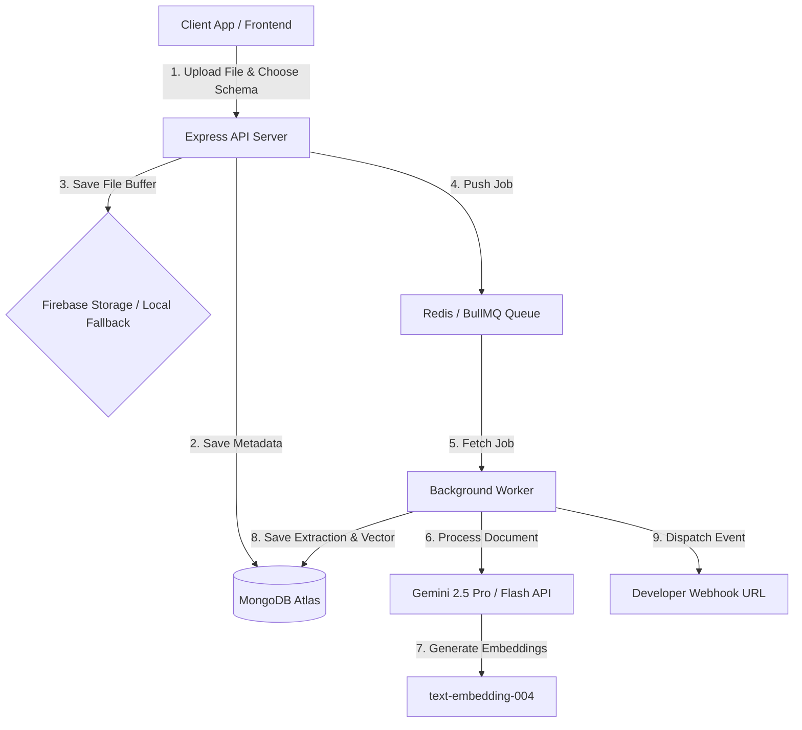

# DOnC-key: Document Intelligence API Platform

A production-style developer dashboard and API platform that transforms raw documents into structured JSON data. Built with React (Vite) + Tailwind CSS v4 on the frontend, and Node.js + Express + BullMQ + MongoDB + Redis + Gemini AI on the backend. 

This is a developer-first platform designed to solve document data extraction, search, and integration challenges in modern applications.

---

## 🚀 Concept & System Architecture

DOnC-key acts as an intermediate **Document ETL (Extract, Transform, Load)** pipeline. Developers can upload documents via a drag-and-drop dashboard or dispatch files programmatically to custom API endpoints. The system handles files asynchronously, runs AI analysis using Gemini models, saves the extraction schema, and triggers real-time webhooks or serves the data through token-authenticated endpoints.



---

## 🛠 Tech Stack

### Frontend
- **React + Vite**: A modern frontend library and build pipeline.
- **Tailwind CSS v4**: Cohesive styling utilizing the latest `@custom-variant` class-based dark mode rules.
- **Firebase Authentication**: Email/password and Google OAuth security.
- **Heroicons**: Clean SVG icon system.
- **Chart.js**: Real-time rendering of API usage, latency metrics, and error rates.

### Backend
- **Node.js + Express**: RESTful API server.
- **Mongoose + MongoDB Atlas**: Document metadata storage, text index matching, and Atlas Vector Search.
- **Redis (Upstash) + BullMQ**: Background job queuing for reliable, parallel file parsing.
- **Google Generative AI SDK**: Text-embeddings-004, Gemini 2.5 Flash, and Gemini 2.5 Pro integrations.
- **Multer**: Multi-file buffer uploads handling.

---

## 📂 Project Structure

```
document-intelligence-platform/
├── backend/              # Node.js + Express backend
│   ├── config/           # Database and Firebase configurations
│   ├── middleware/       # Token validators, rate limiters, audit log hooks
│   ├── models/           # Mongoose schemas (Document, Webhook, ApiLog, ApiKey)
│   ├── routes/           # REST endpoints (data, documents, webhooks, logs)
│   ├── utils/            # Document text extractors, Gemini AI integration
│   ├── server.js         # Main server file
│   └── worker.js         # BullMQ queue processor
└── frontend/             # React + Vite frontend
    ├── src/
    │   ├── components/    # Reusable UI (Playground, Webhook Settings, Logs Tab)
    │   ├── context/       # Auth and Theme provider states
    │   ├── pages/         # Dashboard, Project Details, Upload Panel
    │   ├── utils/         # API client handlers
    │   └── index.css      # Core style utilities and Tailwind imports
```

---

## 📱 Core Features

### 1. Storage & Upload Architecture
- **Dual-Storage Engine**: Supports direct upload to Firebase Storage, with an **automatic local filesystem fallback** (`/backend/temp`) if Firebase billing is disabled or credentials are missing.
- **Parallel Bulk Uploads**: Upload up to 10 files simultaneously via the dashboard dropzone. BullMQ background workers schedule and parse each file concurrently.

### 2. Custom Extraction Schemas
- **Dynamic Prompt Engineering**: Instead of relying on rigid hardcoded outputs, developers can build a custom JSON extraction schema (fields, types, and descriptions) inside the upload panel.
- **Multi-Model Selector**: Pick between `gemini-2.5-flash` (optimized for fast OCR and text classification) and `gemini-2.5-pro` (optimized for deep structural reasoning on complex contracts).

### 3. Developer Webhooks & Event Subscriptions
- **Event Callbacks**: Webhooks allow third-party integrations to receive real-time updates. Register callback URLs that listen for:
  - `document.ready`: Triggered when the AI successfully parses a document.
  - `document.failed`: Triggered if file corruption or processing errors occur.

### 4. Interactive Request Playground
- **Embedded API Sandbox**: Test authentication credentials and API paths directly inside the dashboard.
- **Performance Diagnostics**: Measures live request latencies (ms), HTTP response headers, and displays colorized JSON outputs.
- **API Request Audit Trail**: Every public key call logs status codes, client IPs, methods, and latencies in a pagination-enabled request history tab.

### 5. Semantic Vector Search
- **AI Embeddings**: Computes 768-dimension vector representation for every document during processing using `text-embedding-004`.
- **Atlas Vector Search**: Executes high-accuracy vector queries (`$vectorSearch` aggregation stage) to find documents based on conceptual similarity (e.g. querying "earnings" matches "revenue went up 14%"). Fallback keyword search triggers automatically if index compilation is pending.

---

## 🔧 Local Configuration

### Backend Setup (`/backend/.env`)
```env
PORT=5000
MONGODB_URI=mongodb+srv://your-mongodb-connection-string
REDIS_URL=redis://your-upstash-redis-url
JWT_SECRET=your-jwt-secret-key
GEMINI_API_KEY=your-google-ai-studio-api-key

# Optional: Set to 'local' to bypass Firebase upload issues
STORAGE_PROVIDER=local

# Optional: Firebase config for cloud storage
FIREBASE_STORAGE_BUCKET=your-bucket-id
FIREBASE_PROJECT_ID=your-project-id
FIREBASE_CLIENT_EMAIL=your-service-account-email
FIREBASE_PRIVATE_KEY="your-private-key"
```

### Frontend Setup (`/frontend/.env`)
```env
VITE_API_BASE_URL=http://localhost:5000/api
VITE_FIREBASE_API_KEY=your-api-key
VITE_FIREBASE_AUTH_DOMAIN=your-auth-domain
VITE_FIREBASE_PROJECT_ID=your-project-id
VITE_FIREBASE_STORAGE_BUCKET=your-storage-bucket
VITE_FIREBASE_MESSAGING_SENDER_ID=your-sender-id
VITE_FIREBASE_APP_ID=your-app-id
```

---

## ⚡ Running the Application

1. **Start the Database & Queue**:
   Ensure MongoDB and Redis are running (or use Cloud Atlas and Upstash credentials).

2. **Start Backend Server**:
   ```bash
   cd backend
   npm install
   npm run dev
   ```

3. **Start Background Worker**:
   ```bash
   cd backend
   npm run worker
   ```

4. **Start Frontend Server**:
   ```bash
   cd ../frontend
   npm install
   npm run dev
   ```

5. Open your browser to `http://localhost:5173`.

---

## ⛓️ Resilience & Distributed Scaling Constraints

To prepare the platform for real-world production limits, DOnC-key implements the following architectural guardrails:

1. **Upstream LLM Rate Caps**:
   Gemini API keys are bound by strict Requests Per Minute (RPM) and Tokens Per Minute (TPM) limits. DOnC-key handles `429 Too Many Requests` errors gracefully by configuring BullMQ's default queue parameters to auto-retry jobs with **exponential backoff delay curves** (base delay of 10s).
   
2. **Webhook Destination Outages**:
   If an external webhook target server goes offline, direct inline requests will drop. DOnC-key isolates webhook dispatching to a dedicated `webhookDelivery` queue. If delivery fails (non-200 responses or timeout errors), the background worker automatically retries the delivery up to 5 times using exponential delay margins.

3. **State Isolation in Distributed Environments**:
   When using the local file storage fallback, uploads are saved locally on the API container's file system (`/backend/temp`). For multiple workers or API instances in a distributed setup (e.g. Kubernetes, AWS ECS), containers **must share a persistent Docker volume mount** to coordinate file accesses. In production, this constraint is resolved by activating the Firebase Storage (or AWS S3) provider, ensuring all worker instances pull files from a centralized cloud bucket.

---

## 🔒 Security Practices
- **Cryptographic SHA-256 Key Hashing**: API Keys are hashed using SHA-256 before database insertion. Incoming requests are hashed in real-time and matched against an indexed prefix for sub-millisecond, O(1) query speeds, eliminating slow hashing layers like bcrypt in high-frequency path execution.
- **Indexed Prefix Lookups**: Verifies API keys in $O(1)$ time by querying a 12-character index prefix, bypassing expensive full-table scans.
- **Token Auth Scoping**: Isolates resources per Firebase Auth tenant/UID boundary.
